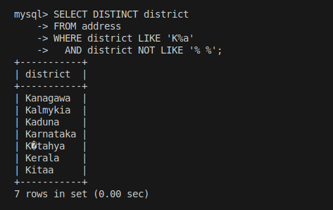
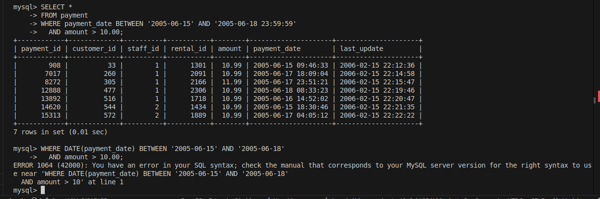
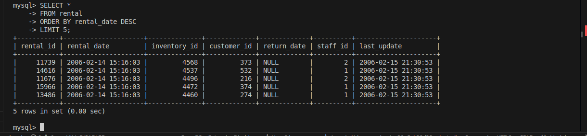
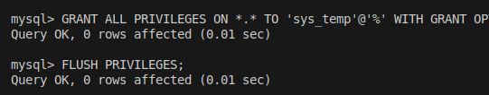

# Домашнее задание к занятию   
**"`Уязвимости и атаки на информационные системы`"** - `Воскобойников Арсений Петрович`
**Задание 1.**  
``` 
Скачайте и установите виртуальную машину Metasploitable: https://sourceforge.net/projects/metasploitable/.

Это типовая ОС для экспериментов в области информационной безопасности, с которой следует начать при анализе уязвимостей.

Просканируйте эту виртуальную машину, используя nmap.

Попробуйте найти уязвимости, которым подвержена эта виртуальная машина.

Сами уязвимости можно поискать на сайте https://www.exploit-db.com/.

Для этого нужно в поиске ввести название сетевой службы, обнаруженной на атакуемой машине, и выбрать подходящие по версии уязвимости.

Ответьте на следующие вопросы:

Какие сетевые службы в ней разрешены?
Какие уязвимости были вами обнаружены? (список со ссылками: достаточно трёх уязвимостей)
Приведите ответ в свободной форме.

```
**Ответ**  
Просканируем развернутый сервер Exploit. Результат сканирования доуступных   
[портов](/conf/result)  [версий_служб](/conf/result_1)

Проверим первые 3 запущенные службы через сервис https://www.exploit-db.com/.
1. 21 ftp vsftpd 2.3.4 - https://www.exploit-db.com/exploits/49757
2. 53 ISC BIND 9.4.2 - https://www.exploit-db.com/exploits/6122
3. 6667 UnrealIRCd Unreal3.2.8.1. https://www.exploit-db.com/exploits/16922
4. 180/ Apache Tomcat/5.5 https://www.exploit-db.com/exploits/12343

**Задание 2.**  
```
Проведите сканирование Metasploitable в режимах SYN, FIN, Xmas, UDP.

Запишите сеансы сканирования в Wireshark.

Ответьте на следующие вопросы:

Чем отличаются эти режимы сканирования с точки зрения сетевого трафика?
Как отвечает сервер?
Приведите ответ в свободной форме.
```
**Ответ**  
Проведем сканирование в режиме **SYN scan**:  
   
Особенности:  
Быстрый и метод, не устанавливает полноценное соединение   

Проведем сканирование в режиме **FIN scan**:  
   
Особенности:  
Закрытые порты отвечают RST, открытые игнорируют    

Проведем сканирование в режиме **Xmas scan**:  
    
Особенности:  
Часто игнорируется открытыми портами  

Проведем сканирование в режиме **UDP scan**:  
    
Особенности:  

Сложнее интерпретировать — нет подтверждений как в TCP, часто получаем ICMP Port Unreachable  