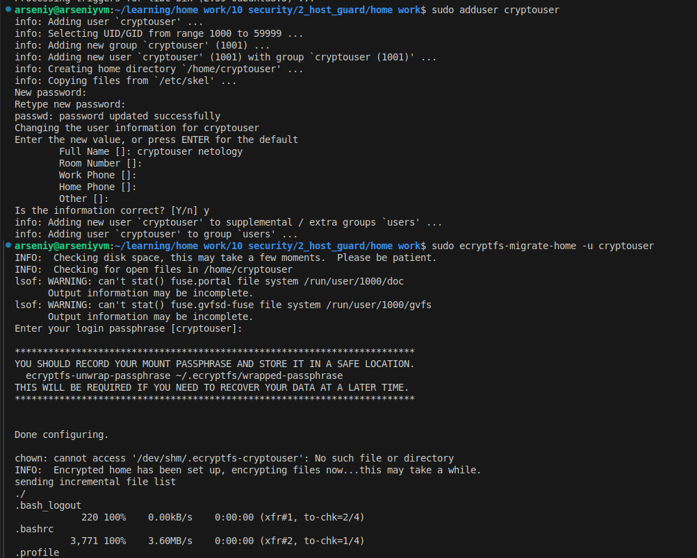
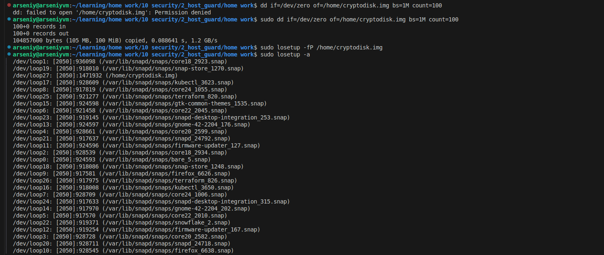

# Домашнее задание к занятию   
**"Защита хоста"** - `Воскобойников Арсений Петрович`  
**Задание 1.**  
``` 
Установите eCryptfs.
Добавьте пользователя cryptouser.
Зашифруйте домашний каталог пользователя с помощью eCryptfs.
В качестве ответа пришлите снимки экрана домашнего каталога пользователя с исходными и зашифрованными данными.
```
**Ответ**  

Установим eCryptfs.
ДОбавим пользователя cryptouser.
Зашифруем домашний каталог пользователя cryptouser


Залогинимся под пользователем cryptouser и создадим тестовые файлы и каталоги. На скриншоте видно, что они хранятся в открытом виде.


Перелогинимся обратно в пользователя Arseniy и сделаем листинг домашнего каталога. 
Видно, что накаталог зашифрован.
  


**Задание 2.**  
```
Установите поддержку LUKS.
Создайте небольшой раздел, например, 100 Мб.
Зашифруйте созданный раздел с помощью LUKS.
В качестве ответа пришлите снимки экрана с поэтапным выполнением задания.
```
**Ответ**  
Установим LUKS.
создададим файл образ размером 100 МБ и смонтируем его.
   
Видно, что диск смонтировался  как loop27

    
Зашифруем раздел. Отроем его.
СОздадим файловую систему.
Смонтируем зашифрованный раздел.
создадим тестовый файл.
    
Видно содержимоей смонтированного каталог.  