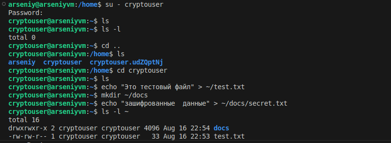

# Домашнее задание к занятию   
**"`SQL. Часть 2`"** - `Воскобойников Арсений Петрович`  
   
**Задание 1**  
``` 
Одним запросом получите информацию о магазине, в котором обслуживается более 300 покупателей, и выведите в результат следующую информацию:

фамилия и имя сотрудника из этого магазина;
город нахождения магазина;
количество пользователей, закреплённых в этом магазине.
```
**Ответ**  
SELECT   
  LOWER(staff.last_name) AS staff_last_name,  
  LOWER(staff.first_name) AS staff_first_name,  
  city.city AS store_city,  
  COUNT(customer.customer_id) AS customer_count  
FROM store  
JOIN staff ON store.manager_staff_id = staff.staff_id  
JOIN address ON store.address_id = address.address_id  
JOIN city ON address.city_id = city.city_id  
JOIN customer ON store.store_id = customer.store_id  
GROUP BY store.store_id, staff.last_name, staff.first_name, city.city  
HAVING COUNT(customer.customer_id) > 300;  

   

**Задание 2**  
```
Получите количество фильмов, продолжительность которых больше средней продолжительности всех фильмов.
```
**Ответ**  
Сделаю остальную часть задачния через DBEAVER
 

**Задание 3**  
```
Получите информацию, за какой месяц была получена наибольшая сумма платежей, и добавьте информацию по количеству аренд за этот месяц.  
```
**Ответ**  
 

**Задание 4***  
```
Посчитайте количество продаж, выполненных каждым продавцом. Добавьте вычисляемую колонку «Премия». Если количество продаж превышает 8000, то значение в колонке будет «Да», иначе должно быть значение «Нет».
``` 
**Ответ**  

  


**Задание 5***  
```
Найдите фильмы, которые ни разу не брали в аренду.
```
**Ответ**  

  