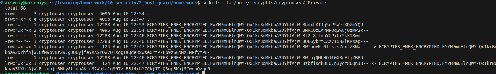

# Домашнее задание к занятию   
**"`Репликация и масштабирование. Часть 1`"** - `Воскобойников Арсений Петрович`  
   
**Задание 1**  
``` 
На лекции рассматривались режимы репликации master-slave, master-master, опишите их различия.

Ответить в свободной форме.
```
**Ответ**  
1. Master-Slave:  
Один сервер выступает как master (главный) — на него идут все записи (write).  
Один или несколько серверов работают как slave (реплики) — они только читают (read) данные, синхронизируясь с master.  

Плюсы:  

Разделение нагрузки на чтение и запись.  
Безопасность — данные можно читать с реплики без риска изменить их.  
Упрощённое восстановление из резервной копии.  

Минусы:

Реплика отстаёт от master (задержка репликации).
Нельзя писать на slave — только читать.
При отказе master требуется ручное переключение.

2. Master-Master  
Описание:  
Несколько серверов являются активными master'ами — они одновременно принимают и чтение, и запись.  
Изменения на одном сервере реплицируются на другие.  

Плюсы:  

Высокая доступность: отказ одного узла не приводит к остановке записи.  
Горизонтальное масштабирование: можно писать в разные узлы.  
Упрощённая балансировка нагрузки.  

Минусы:

Возможны конфликты при записи, если два master'а изменяют одни и те же данные.  
Требует механизмов разрешения конфликтов (например, last-write-wins, timestamp-based).  
Более сложная настройка и сопровождение.  

**Задание 2**  
```
Выполните конфигурацию master-slave репликации, примером можно пользоваться из лекции.

Приложите скриншоты конфигурации, выполнения работы: состояния и режимы работы серверов.
```
**Ответ**  
Запустим docker compose файл из лекции:
  

Проведем настройки мастер сервера согласно рекомендациям из лекции:
  

Проведем настройку подключения к мастеру:  
  

Репликация работает корректно:  

  
Так же добавляю сами файлы конфигураций:


[Кронфиг Master](/my_sql_replication-master/mysql_repl_master_slave/master/my.cnf)


[Кронфиг Slave ](/my_sql_replication-master/mysql_repl_master_slave/slave/my.cnf)

[Кронфиг Docker Compose ](/my_sql_replication-master/mysql_repl_master_slave/docker-compose.yml)